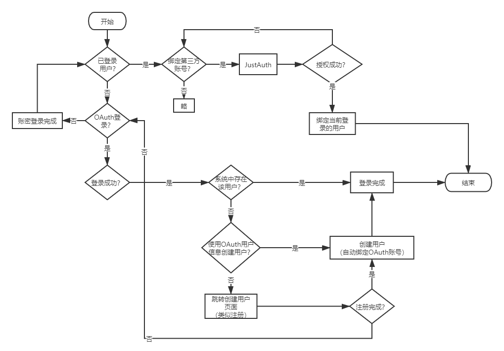

# XD11CC Single - Multi-Tenant SaaS Backend Framework

**English | [中文](README.md)**



A production-ready, multi-tenant SaaS backend framework built on Spring Boot 2.7 with Java 8, providing out-of-the-box enterprise solutions for authentication, authorization, real-time messaging, and task scheduling.

## Tech Stack

| Layer | Technology | Version | Description |
|------|------|------|------|
| **Core Framework** | Spring Boot | 2.7.18 | Application framework |
| **Security** | Spring Security + JWT | 5.7.x + 0.11.5 | Stateless authentication, Redis session management |
| **Social Login** | JustAuth | 1.16.7 | OAuth2 third-party login (GitHub/Google/WeChat, etc.) |
| **ORM** | MyBatis-Plus | 3.5.3.1 | Enhanced CRUD + auto-fill + multi-tenant interceptor |
| **Pagination** | PageHelper | 1.4.6 | ThreadLocal-based pagination interceptor |
| **Database** | MySQL | 8.0.33 | utf8mb4 + utf8mb4_0900_ai_ci |
| **Connection Pool** | Druid | 1.2.24 | SQL monitoring + slow query detection + dynamic multi-datasource |
| **Cache** | Redis + Redisson | 6.0+ / 3.36.0 | Distributed lock, rate limiting, session storage |
| **Message Queue** | RabbitMQ | 2.7.x | Async decoupling, event notifications |
| **Real-time** | Netty WebSocket | 4.1.x | Independent port, long-connection push |
| **Task Scheduling** | XXL-JOB + Quartz | 2.4.0 / 2.7.x | Distributed cron tasks + local scheduling |
| **Object Storage** | MinIO | 8.6.0 | S3-compatible distributed storage |
| **Payment** | Alipay SDK + WeChat Pay SDK | 4.40.831 / 4.8.0 | Multi-channel payment client abstraction |
| **API Docs** | Swagger2 + Knife4j | 2.9.2 / 3.0.3 | Online API documentation |
| **Containerization** | Docker + Docker Compose | - | One-command deployment |
| **Utilities** | Hutool / Fastjson2 / MapStruct / EasyExcel / TTL | 5.8.16 / 2.0.39 / 1.6.3 / 3.3.2 / 2.13.2 | Utility library collection |

## Features

### Core Architecture

- **Multi-Tenant Isolation** — Shared database with row-level isolation. `TenantFilter` extracts tenant ID from domain/header, `TransmittableThreadLocal` propagates tenant context to async threads, `MyBatis-Plus TenantLineInnerInterceptor` auto-appends `WHERE tenant_id = ?` conditions
- **Dynamic Datasource** — Runtime datasource switching via `@DataSource` annotation + AOP, supports read/write split scenarios
- **RBAC Permission System** — Complete user, role, menu, department, and post permission model with fine-grained access control
- **Data Permission Control** — `@DataScope` annotation enables department-level/personal-level data isolation, dynamically appends department filter conditions via AOP
- **Code Generator** — Freemarker-based template engine for rapid CRUD code generation (Controller/Service/Mapper/Entity/VO/DTO)

### Security Module

- **JWT Authentication** — Stateless token auth with JWT as Redis key index, server-side session lifecycle control (kick user, refresh permissions)
- **OAuth2 Social Login** — Integrated with JustAuth, supporting 20+ social platforms (GitHub, Google, WeChat, etc.)
- **API Rate Limiting** — `@RateLimit` annotation-driven, based on Redisson `RRateLimiter` token bucket algorithm, supports three dimensions: IP / User / Global
- **RSA Encryption** — End-to-end password transmission encryption
- **CAPTCHA** — Image CAPTCHA with Redis TTL expiration, prevents brute force attacks
- **CORS** — Unified cross-origin configuration with whitelisted domain control

### Middleware Integration

- **WebSocket Push** — Netty-based WebSocket server on independent port (12001) with token authentication, heartbeat detection (30s), and idle connection cleanup
- **Message Queue** — RabbitMQ with producer Confirm + Return callbacks to prevent message loss, manual consumer ACK for reliable consumption
- **Distributed Scheduling** — XXL-JOB with shard broadcasting, failover, and retry capabilities
- **Local Scheduling** — Quartz integration supporting memory mode + JDBC persistence dual modes, `AbstractQuartzJob` base class encapsulating execution context (tenant ID, execution params), supports `@DisallowConcurrentExecution` for concurrency control
- **Distributed Lock** — `@Lock` annotation-driven, based on Redisson RLock, supports SpEL-based dynamic lock key granularity (ALL/KEY modes), configurable wait timeout, retry count, and auto-release time
- **Payment Integration** — Unified `PayClient` interface abstracting multi-channel payment (Alipay PC/WAP/QR/App/Barcode + WeChat JSAPI/Native/WAP/App/Barcode), `@PayClientCode` annotation + factory pattern for auto-registration, supports unified order, refund, and callback parsing
- **Object Storage** — MinIO file upload/download with pre-signed URL direct uploads to reduce backend bandwidth
- **PDF Conversion** — Spire.PDF integration for PDF to Word and other document format conversions

### Infrastructure

- **Global Exception Handling** — Unified error response format with modular error codes (Type_Module_Number)
- **Operation Logging** — `@OperateLog` annotation auto-records operation logs asynchronously without blocking the main flow
- **Login Logging** — Records login IP, device, time, and status for audit trails
- **Request Monitoring** — Druid SQL monitoring dashboard with slow query auto-detection and alerts
- **Parameter Validation** — JSR-303 annotation validation (`@Valid` + `@NotBlank`/`@NotNull`, etc.)
- **Type-Safe Pagination** — `PageResult<T>` generic wrapper with `PageUtils.page()` for unified pagination logic
- **Thread Pool Management** — Dedicated thread pool isolation (Netty, operation log, notice push) with `DelegatingSecurityContextExecutor` for security context propagation
- **Docker Deployment** — Docker Compose one-command deployment for app + middleware

### Business Modules

- **System Management** — Users, roles, menus, departments, posts, dictionaries, configs, logs
- **Tenant Management** — Tenant CRUD, domain binding, tenant isolation configuration
- **Notifications** — System announcements, publish/revoke, read status management
- **File Management** — File upload/download/preview (MinIO)
- **Social Login Config** — Third-party login application configuration management

## Project Structure

```
src/main/java/com/xd11cc/single/
├── config/                       # Configuration & Infrastructure
│   ├── annotation/               # Custom annotations
│   │   ├── DataScope.java        #   Data permission control
│   │   ├── DataSource.java       #   Dynamic datasource switching
│   │   ├── Lock.java             #   Distributed lock
│   │   ├── OperateLog.java       #   Operation log recording
│   │   ├── PayClientCode.java    #   Payment channel marker
│   │   ├── PayClientScan.java    #   Payment client scan registration
│   │   ├── RateLimit.java        #   API rate limiting
│   │   └── TenantIgnore.java     #   Skip tenant filter
│   ├── aspectj/                  # AOP aspect implementations
│   ├── auth/                     # OAuth2 social login config (AuthRequestFactory)
│   ├── context/                  # Context holders (Tenant/DataSource/Permission)
│   ├── event/                    # Spring events (NoticeEvent/NoticeEventListener)
│   ├── exception/                # Custom exceptions & ErrorCode interface
│   ├── filter/                   # Servlet filters (JWT auth / Tenant identification)
│   ├── handler/                  # Handlers (Security auth success/failure, MyBatis auto-fill, global exception)
│   ├── initializer/              # Startup initializers (tenant cache warm-up)
│   ├── interceptor/              # Spring MVC interceptors (tenant DB interceptor)
│   ├── mq/                       # RabbitMQ queue configuration
│   ├── netty/                    # Netty WebSocket server (Server/Channel/Handler)
│   ├── pay/                      # Payment client abstraction layer (factory / Alipay / WeChat)
│   ├── properties/               # @ConfigurationProperties classes
│   ├── schedule/                 # Scheduled tasks (quartz / xxl)
│   ├── MybatisPlusConfig.java    # MyBatis-Plus config (interceptors / pagination)
│   ├── SecurityConfig.java       # Spring Security config
│   ├── RedisConfig.java          # Redis serialization config
│   ├── DruidConfig.java          # Druid connection pool + monitoring config
│   ├── ThreadPoolConfig.java     # Thread pool config (netty / log / notice)
│   ├── NettyServer.java          # Netty WebSocket startup class
│   └── QuartzConfig.java         # Quartz scheduler config
├── constants/                    # Application constants (CacheConstants/SecurityConstants)
├── controller/                   # REST API controllers
├── convert/                      # MapStruct object converters
├── entity/
│   ├── base/                     # Base entities (BaseDO/BaseTenantDO/ResponseVO/PageVO/PageResult)
│   ├── domain/                   # Database entities (DO)
│   ├── dto/                      # Data transfer objects (internal flow)
│   └── vo/                       # View objects (request/response)
├── enums/                        # Business enumerations (SystemErrorEnum, etc.)
├── mapper/                       # MyBatis-Plus mappers
├── service/                      # Business logic interfaces
│   └── impl/                     # Service implementations
└── utils/                        # Utility classes
    ├── SecurityUtils.java        #   Security utils (get current user / encryption)
    ├── PageUtils.java            #   Pagination utils (unified pagination logic)
    ├── TreeUtils.java            #   Tree structure utils (O(n) HashMap implementation)
    ├── ExcelUtils.java           #   Excel import/export (EasyExcel)
    ├── AssertUtils.java          #   Assertion utils (throws ServiceException on failure)
    ├── JsonUtils.java            #   JSON serialization (Fastjson2)
    ├── DateUtils.java            #   Date utilities
    ├── MaskUtils.java            #   Data masking (phone / ID card / email)
    └── ...                       #   Other utility classes
```

## Quick Start

### Prerequisites

- JDK 8+
- MySQL 8.0+
- Redis 6.0+
- RabbitMQ 3.8+ (optional)
- MinIO (optional)

### Local Development

1. **Create database**

```sql
CREATE DATABASE xd11cc_single DEFAULT CHARACTER SET utf8mb4;
```

Import the schema from `doc/sql/xd11cc_single.sql`.

2. **Configure application**

Update database, Redis, and other service credentials in `src/main/resources/application-dev.yml`.

3. **Start**

```bash
mvn spring-boot:run
```

Application URL: `http://localhost:10001/xd11cc`

API documentation: `http://localhost:10001/xd11cc/swagger-ui.html`

### Docker Deployment

```bash
# Package
mvn clean package -DskipTests

# Build image
docker build -t xd11cc-single .

# Start
docker-compose up -d
```

## API Endpoints

| Module | Endpoint | Description |
|------|------|------|
| **Auth** | `POST /login/loginByPassword` | Username/password login |
| Auth | `GET /login/getCaptcha` | Get CAPTCHA |
| Auth | `GET /login/getUserInfo` | Get current user info |
| Auth | `GET /login/getRoutes` | Get user route menus |
| Auth | `GET /login/authorize/{source}` | OAuth2 social login |
| Auth | `GET /login/callback/{source}` | OAuth2 callback |
| **User** | `POST /system/user/page` | User paginated list |
| User | `POST /system/user/add` | Add user |
| User | `PUT /system/user/edit` | Edit user |
| User | `DELETE /system/user/remove/{id}` | Delete user |
| User | `PUT /system/user/resetPassword` | Reset password |
| **Role** | `POST /system/role/page` | Role paginated list |
| Role | `POST /system/role/assign` | Assign role permissions |
| **Menu** | `GET /system/menu/list` | Menu list (tree) |
| **Dept** | `GET /system/dept/list` | Department list (tree) |
| Dept | `POST /system/dept/add` | Add department |
| **Post** | `POST /system/post/page` | Post paginated list |
| **Dict** | `POST /system/dict/type/page` | Dict type paginated list |
| Dict | `POST /system/dict/data/page` | Dict data paginated list |
| **Config** | `POST /system/config/page` | System config paginated list |
| **Tenant** | `POST /system/tenant/page` | Tenant paginated list |
| Tenant | `POST /system/tenant/add` | Add tenant |
| Tenant | `PUT /system/tenant/edit` | Edit tenant |
| **Notice** | `POST /system/notice/page` | Notice paginated list |
| Notice | `POST /system/notice/publish/{id}` | Publish notice |
| Notice | `PUT /system/notice/revoke/{id}` | Revoke notice |
| **Log** | `POST /system/operateLog/page` | Operation log paginated list |
| Log | `POST /system/loginLog/page` | Login log paginated list |
| **File** | `POST /file/upload` | File upload (MinIO) |
| File | `GET /file/download/{id}` | File download |
| **CodeGen** | `POST /generate/code/preview` | Code generation preview |
| CodeGen | `POST /generate/code/download` | Code generation download |
| **Social Login** | `POST /auth/client/config/list` | Social login config list |

## Architecture Highlights

### Multi-Tenant Data Isolation

```
Request → TenantFilter (extract tenant ID from domain/header)
        → TenantContextHolder (store in TransmittableThreadLocal, auto-propagate to async threads)
        → JwtAuthenticationTokenFilter (JWT authentication)
        → TenantDatabaseInterceptor (MyBatis-Plus TenantLineInnerInterceptor auto-appends WHERE tenant_id = ?)
        → Business logic execution
        → TenantContextHolder.clear() (cleanup in finally block, prevents thread pool pollution)
```

**Key Design**:
- `TransmittableThreadLocal` solves tenant context loss caused by thread pool reuse
- `@TenantIgnore` annotation + AOP allows specific methods to skip tenant filtering (e.g., admin cross-tenant queries)
- `TenantUtils.executeIgnore()` programmatic skip
- Logical delete field `del_flag = NULL` combined with unique index `(xxx, tenant_id, del_flag)` — NULL does not participate in uniqueness checks, allowing重建 (re-create) of deleted records

### Authentication Flow

```
Login Request → LoginService.loginByPassword()
              → UserDetailServiceImpl.loadUserByUsername() (Spring Security authentication)
              → BCryptPasswordEncoder password validation
              → JWT Token generation (UUID as Redis key)
              → Redis stores LoginUserDTO (TTL auto-expires)
              → Return Token

Subsequent Requests → JwtAuthenticationTokenFilter
                    → Extract token from header
                    → Query LoginUserDTO from Redis
                    → Validate token expiry (auto-renew when remaining time < threshold)
                    → Build UsernamePasswordAuthenticationToken
                    → Set SecurityContextHolder
                    → Continue filter chain
                    → finally: TenantContextHolder.clear()
```

**Key Design**:
- JWT as Redis key index allows server-side kick/refresh of permissions
- Token renewal at filter layer, transparent to client
- Fully stateless (`SessionCreationPolicy.STATELESS`)

### Rate Limiting

```java
@RateLimit(key = "login:", time = 60, count = 10, type = RateLimitEnum.IP)
@PostMapping("/login/loginByPassword")
public ResponseVO<String> loginByPassword(...) { ... }
```

**Implementation**:
- `@RateLimit` annotation + `RateLimitAspect` AOP
- Redisson `RRateLimiter` token bucket algorithm (multi-instance quota sharing in distributed scenarios)
- Supports three dimensions: `IP` / `USER` / `DEFAULT`
- Key format: `rate_limit:{key}:{type}:{identifier}`

### Distributed Lock

```java
@Lock(prefix = "order:pay", key = "#orderId", waitTime = 3, leaseTime = 30)
public void processPayment(String orderId) { ... }
```

**Implementation**:
- `@Lock` annotation + `LockAspect` AOP aspect
- Redisson `RLock` reentrant lock implementation
- Supports two granularity modes: `ALL` (global mutual exclusion) / `KEY` (sharded by SpEL expression)
- Configurable parameters: `waitTime` (lock acquisition timeout), `leaseTime` (auto-release time), `retryTimes` (retry count)
- Lock key format: `lock:{prefix}:{lockMode}:{resolvedKey}`

### Payment Client Architecture

```
Payment Request → PayClientFactory.getPayClient(channel)
                → PayClient.unifiedOrder(reqDTO)      // Unified order placement
                → PayClient.parseOrderNotify(...)     // Channel callback parsing
                → PayClient.unifiedRefund(reqDTO)     // Unified refund
                → PayClient.parseRefundNotify(...)    // Refund callback parsing
```

**Key Design**:
- `PayClient<Config>` generic interface unifies channel differences across Alipay/WeChat/etc.
- `@PayClientCode(PayChannelEnum.ALIPAY_WAP)` annotation marks channel implementation classes
- `PayClientScannerRegistrar` scans and registers implementations into `PayClientFactory` at startup
- `AbstractAlipayPayClient` / `AbstractWxPayClient` encapsulates common SDK logic
- Supported channels: Alipay (PC/WAP/QR/App/Barcode), WeChat (JSAPI/Native/WAP/App/Barcode)

### Thread Pool Design

```java
// Netty business thread pool (IO-intensive)
@Bean("nettyTaskExecutor")
corePoolSize = CPU_CORES, maxPoolSize = CPU_CORES * 2
RejectionPolicy = DiscardPolicy (WebSocket messages can tolerate loss)
Wrapper = TtlExecutors.getTtlExecutor() (propagate ThreadLocal)

// Operation log thread pool (data must not be lost)
@Bean("operateLogExecutor")
corePoolSize = CPU_CORES / 2, maxPoolSize = CPU_CORES
RejectionPolicy = CallerRunsPolicy (back-pressure to calling thread, ensures no log loss)
Wrapper = DelegatingSecurityContextExecutor + TTL (propagate SecurityContext + ThreadLocal)

// Notice push thread pool
@Bean("noticeTaskExecutor")
corePoolSize = CPU_CORES / 2, maxPoolSize = CPU_CORES
RejectionPolicy = CallerRunsPolicy
Wrapper = TtlExecutors.getTtlExecutor()
```

**Key Design**:
- Dedicated thread pool isolation to prevent cross-business interference
- `DelegatingSecurityContextExecutor` propagates SecurityContext to async threads
- `TtlExecutors.getTtlExecutor()` propagates TransmittableThreadLocal
- Rejection policy principle: loss-tolerant → Discard; loss-intolerant → CallerRuns

### Netty WebSocket Architecture

```
Client Connection → BossGroup(1 thread) accepts connections
                  → WorkerGroup(N threads) handles read/write
                  → Pipeline chain:
                      1. HttpServerCodec (HTTP encoding/decoding)
                      2. ChunkedWriteHandler (large data chunking)
                      3. HttpObjectAggregator (HTTP aggregation)
                      4. IdleStateHandler (30s read idle / 60s write idle detection)
                      5. WebSocketServerProtocolHandler (WebSocket handshake)
                      6. WebSocketAuthHandler (custom token auth)
                      7. WebSocketServerHandler (business message processing)
                  → ChannelManager manages user connection mapping (userId ↔ Channel)
```

**Key Design**:
- Independent port (12001), no interference with HTTP requests
- Reactor multi-threaded model, supports 10k+ connections on a single machine
- TCP tuning: `TCP_NODELAY=true` disables Nagle algorithm for lower latency
- Heartbeat: disconnects dead connections after 30s without client messages

### Data Permission Control

```java
@DataScope(deptAlias = "d", userAlias = "u")
@PostMapping("/system/user/page")
public ResponseVO<PageResult<SystemUserVO>> page(...) { ... }
```

**Implementation**:
- `@DataScope` annotation + `DataScopeAspect` AOP
- Dynamically appends SQL conditions based on user's data permission level:
  - All data: no additional conditions
  - Custom permissions: `WHERE d.id IN (1,2,3)`
  - Same department: `WHERE d.id = #{deptId}`
  - Department and below: `WHERE d.id IN (recursive sub-department query)`
  - Self only: `WHERE u.id = #{userId}`

## Roadmap

- [x] Organization architecture (User, Role, Menu, Dept, Post)
- [x] Spring Security + JWT authentication
- [x] RBAC permissions + data permission control
- [x] Swagger2 API documentation
- [x] Druid dynamic multi-datasource
- [x] Redis + Redisson caching & rate limiting
- [x] RabbitMQ message queue
- [x] XXL-JOB task scheduling
- [x] Netty WebSocket real-time push
- [x] MinIO file storage
- [x] OAuth2 social login (JustAuth)
- [x] Docker containerization
- [x] Freemarker code generator templates
- [x] Multi-tenant data isolation
- [x] Notification module
- [x] Quartz scheduled tasks (memory + JDBC persistence)
- [x] Distributed lock (@Lock annotation)
- [x] Payment infrastructure (multi-channel client abstraction layer, business APIs in progress)
- [ ] Payment business APIs (order creation / callback handling / refund flow)
- [ ] Enhanced audit logs (field-level change tracking)
- [ ] Internationalization (i18n)

## License

See [LICENSE](LICENSE) for details.
